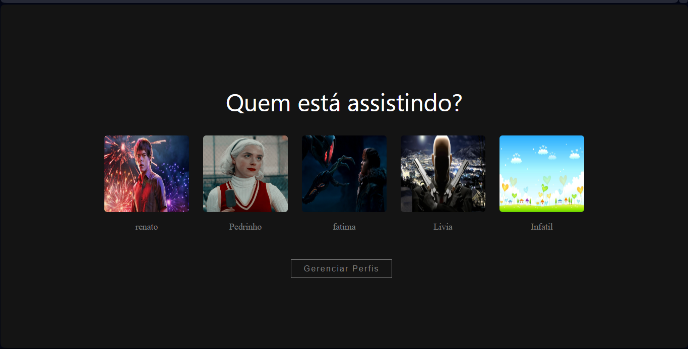

# Netflix - Perfis de Acesso 🎬

---

## Introdução

Bem-vindo à página de Perfis de Acesso da Netflix! Aqui, você pode gerenciar e personalizar os perfis associados à sua conta da Netflix. Os perfis de acesso permitem que cada membro da sua família ou grupo tenha uma experiência personalizada ao assistir à Netflix.

## Recursos 🛠️

- **Adicionar Perfil:** Crie um novo perfil para membros adicionais da família ou amigos que compartilham sua conta.
- **Editar Perfil:** Modifique o nome, a imagem do perfil e as configurações de restrição etária de perfis existentes.
- **Excluir Perfil:** Remova perfis que não são mais necessários.

## Como Usar 📝

1. **Faça login:** Acesse sua conta da Netflix com suas credenciais.
2. **Acesse os Perfis:** Navegue até a seção "Gerenciar Perfis" ou "Gerenciar Conta" (dependendo da interface).
3. **Adicionar Perfil:** Clique em "Adicionar Perfil" e siga as instruções para criar um novo perfil.
4. **Editar Perfil:** Selecione o perfil que deseja editar e escolha a opção "Editar Perfil" para fazer alterações.
5. **Excluir Perfil:** Para remover um perfil, selecione a opção "Excluir Perfil" e confirme a exclusão.

## Dicas 💡

- **Imagens de Perfil:** Personalize cada perfil com uma imagem única para facilitar a identificação.
- **Restrições de Idade:** Utilize as configurações de restrição etária para controlar o tipo de conteúdo acessível a cada perfil.
- **Nomes Descritivos:** Escolha nomes descritivos para os perfis, como "Crianças", "Adolescentes", etc., para facilitar o gerenciamento.

## Segurança 🔒

- **Senha:** Mantenha sua senha da Netflix segura e não a compartilhe com pessoas não autorizadas.
- **Acesso Remoto:** Esteja ciente de quem tem acesso à sua conta e limite o compartilhamento de login e senha.

## Suporte 📞

Para mais informações ou assistência, visite o Centro de Ajuda da Netflix ou entre em contato com o suporte ao cliente.

---

Este README fornece uma visão geral sobre como utilizar a funcionalidade de Perfis de Acesso na Netflix. Certifique-se de manter suas configurações atualizadas para uma experiência de streaming personalizada e segura!
